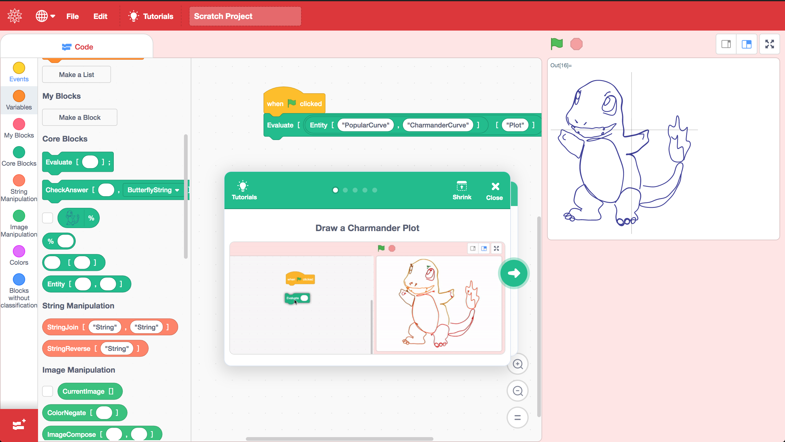
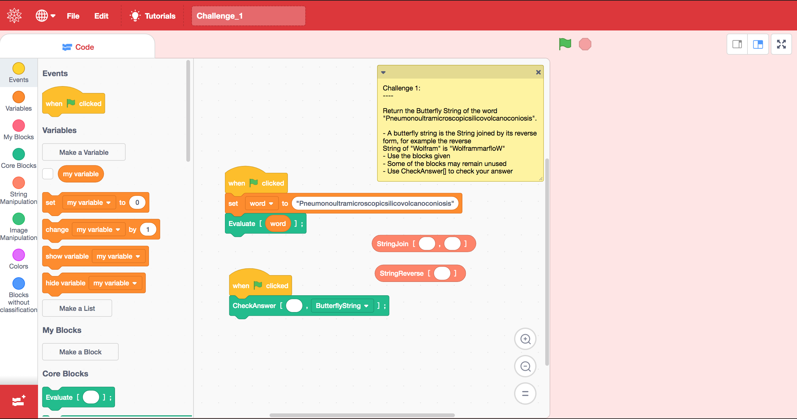

# BlockyWL: A CodeBlock interface for the Wolfram Language

BlockyWL is a project based on Scratch 3.0 to teach kids Functional Programming using Wolfram Language, developed as a POC during Wolfram Summer School 2019. a further description of the development can be found in https://community.wolfram.com/groups/-/m/t/1729082



# Installation
This requires to have Git and Node.js installed
also, a Wolfram Language Kernel (it can either be Mathematica, Wolfram Desktop or the Free Wolfram Engine)

To setup the development environment:
```
    git clone --recurse-submodules git@github.com:Mackaber/BlockyWL.git
    cd BlockyWL
    npm install
    
```

Then you need to install the Dependencies of scratch-vm
```

# Running the Development server 

Open a Command Prompt or Terminal in the repository and run:
```
    npm start
```

The server in the default configuration should be running at http://127.0.0.1:8601/

# Add Functions

BlockyWL can perform any function from WL that produces a static visual output, like a text, an image, a plot, etc.

- To add new functions for the WL is necessary to add them under client/scratch-vm/src/wolfram_blocks (or any other directory)
- The blocks follows exactly the same structure as the regular Scratch 3.0 extensions which documentation can be found here https://github.com/LLK/scratch-vm/blob/develop/docs/extensions.md
- Most of the blocks used are BlockType.REPORTER because of the functional nature of the language (everything returns something)
- The text part make use of the long brackets ［  and  ］since regular brackets get parsed as arguments.
- Most of the functions that are mapped to WL functions will follow the same structure
- Once done the extension must be registered in `client/scratch-vm/src/extension-manager.js` and `client/scratch-vm/src/virtual-machine.js`

For example:

```javascript
    // BlockyWL/client/scratch-vm/src/wolfram_blocks/wl_example.js

    const ArgumentType = require('../extension-support/argument-type');
    const BlockType = require('../extension-support/block-type');

    class WLExample {
        constructor (runtime) {
            this.runtime = runtime;
        }

        getInfo() {
            return {
                id: 'wlExample',
                name: 'Example Category',
                blocks: [
                    {
                        opcode: 'functionWithoutArgument',
                        blockType: BlockType.REPORTER,
                        text: "FunctionWithoutArgument",
                    },
                    {
                        opcode: 'functionWitOneArgument',
                        blockType: BlockType.REPORTER,
                        text: "FunctionWitOneArgument［[ARG]］",
                        arguments: {
                            ARG: {
                                type: ArgumentType.STRING,
                            },
                        }
                    },
                    {
                        opcode: 'functionWitTwoArguments',
                        blockType: BlockType.REPORTER,
                        text: "FunctionWitTwoArgument［[ARG1],[ARG2]］",
                        arguments: {
                            ARG1: {
                                type: ArgumentType.STRING,
                            },
                            ARG2: {
                                type: ArgumentType.STRING,
                            }
                        }
                    }
                    //...
                ]
            }
        }

        functionWithoutArgument() {
            return `FunctionWithoutArgument[]`
        }

        functionWitOneArgument(args, util) {
            return `FunctionWitOneArgument[${args.ARG}]`;
        }

        functionWitTwoArguments(args,util) {
            return `FunctionWitTwoArgument[${args.ARG1},${args.ARG2}]`;
        }
    }

    module.exports = WLExample;
```

```javascript
    // BlockyWL/client/scratch-vm/src/extension-manager.js
    // Line 11
    const builtinExtensions = {
        // This is an example that isn't loaded with the other core blocks,
        // but serves as a reference for loading core blocks as extensions.
        coreExample: () => require('../blocks/scratch3_core_example'),
        // These are the non-core built-in extensions.
        pen: () => require('../extensions/scratch3_pen'),
        wedo2: () => require('../extensions/scratch3_wedo2'),
        music: () => require('../extensions/scratch3_music'),
        microbit: () => require('../extensions/scratch3_microbit'),
        text2speech: () => require('../extensions/scratch3_text2speech'),
        translate: () => require('../extensions/scratch3_translate'),
        videoSensing: () => require('../extensions/scratch3_video_sensing'),
        ev3: () => require('../extensions/scratch3_ev3'),
        makeymakey: () => require('../extensions/scratch3_makeymakey'),
        boost: () => require('../extensions/scratch3_boost'),
        gdxfor: () => require('../extensions/scratch3_gdx_for'),

        // Wolfram Blocks Extensions
        wlBaseBlocks: () => require('../wolfram_blocks/wl_core'),
        wlStringBlocks: () => require('../wolfram_blocks/wl_strings'),
        wlImageBlocks: () => require('../wolfram_blocks/wl_image'),
        wlGraphics: () => require('../wolfram_blocks/wl_graphics'),
        wlColors: () => require('../wolfram_blocks/wl_colors'),
        wlElseBlocks: () => require('../wolfram_blocks/wl_else'),
        wlExample: () => require('../wolfram_blocks/wl_example') // <-- Add here!
    };
```

```javascript
    // BlockyWL/client/scratch-vm/src/virtual-machine.js
    // Line 31
    const CORE_EXTENSIONS = [
    // 'motion',
    // 'looks',
    // 'sound',
    // 'events',
    // 'control',
    // 'sensing',
    // 'operators',
    // 'variables',
    // 'myBlocks'
    'wlBaseBlocks',
    'wlStringBlocks',
    'wlImageBlocks',
    'wlColors',
    'wlElseBlocks',
    'wlExample' // <-- Add here
];
```

# Add Tutorials


Tutorials are useful to understand the basics of a category of functions, how to use them and what can be done with them.

- Tutorials can contain Text and images, animated GIFs or videos, this should be added to `client/scratch-gui/src/lib/libraries/decks/wl_steps`
- Also a descriptive thumbnail must be added to `client/scratch-gui/src/lib/libraries/decks/wl_thumbnails`
- The steps of the tutorial must then be added to `client/scratch-gui/src/lib/libraries/decks/index.jsx`
- A media element corresponds to each one of the steps and should be added without the filename extension

Example:

```javascript
    // BlockyWL/client/scratch-gui/src/lib/libraries/decks/index.jsx
    // Line 8
    import charmanderPlot from './wl_thumbnails/charmander_plot.png';
    import exampleThumbnail from './wl_thumbnails/example_thumbnail.png'; // <-- Add here!

    // Line 101
            ],
        urlId: 'charmander_plot'
    },
    'example-tutorial': { // <-- Add here!
        name: (
            <FormattedMessage
                defaultMessage="Examples of a tutorial"
                description="The examples of a tutorial"
                id="gui.tutorial.example"
            />
        ),
        tags: ['Example'],
        img: exampleThumbnail,
        steps: [
            {
            video: 'some-video',
            },
            {
                title: (
                    <FormattedMessage
                        defaultMessage="An example Step"
                        id="gui.tutorial.example.step_1"
                    />
                ),
                image: 'example_step_1'
            },
            { /* Each element from steps, represent a step, it can either be a standalone image/video or include a title */}
        ]
    }
```

# Add Challenges

Challenges are exercises with specific code-blocks to check what has been learned so far.




- Challenges are saved files with a note containing the instructions and the code blocks that are use to solve the challenge
- The "CheckAnswer" block should be included between these blocks to check the answer
- To add a new challenge, the answer or the function to check the answer should be added to `server/challenges.wl` and its name must be added to `client/scratch-vm/src/wolfram_blocks/wl_core.js`. It can also be a function that can take different inputs and every output should match the one from the response to be correct.
- Examples of challenges and their solutions can be found in `challenges`


- Example 

```Mathematica
    (* BlockyWL/server/challenges.wl *)
    (* Line 9 *)
    ExampleChallenge :> SameQ[resp,"Correct Answer"],
    AnotherExampleChallenge :> SameQ[resp[TestInputs],AdvancedFunction[TestInputs]]

    (* Line 13 *)
    TestInputs = {1,2,3,4,5};
    AdvancedFunction[input_] := input + 1
```

```javascript
    // BlockyWL/client/scratch-vm/src/wolfram_blocks/wl_core.js
    // Line 93
    ], menus: {
        CHALLENGES: [
            'ButterflyString',
            'MostCommonLetters',
            'ExampleChallenge', // <-- Add here
            'AnotherExampleChallenge'
        ]
    }
```

# Issues

- The project is still in a very early stage, and since there isn't still enough documentation for Scratch 3.0 (which is still in Beta), a lot of the code consisted of hacks.

- Strings inside blocks need to contain quotations marks in order to work correctly.

- Functions must be done by assigning them to a variable, which isn't the obvious behavior.
